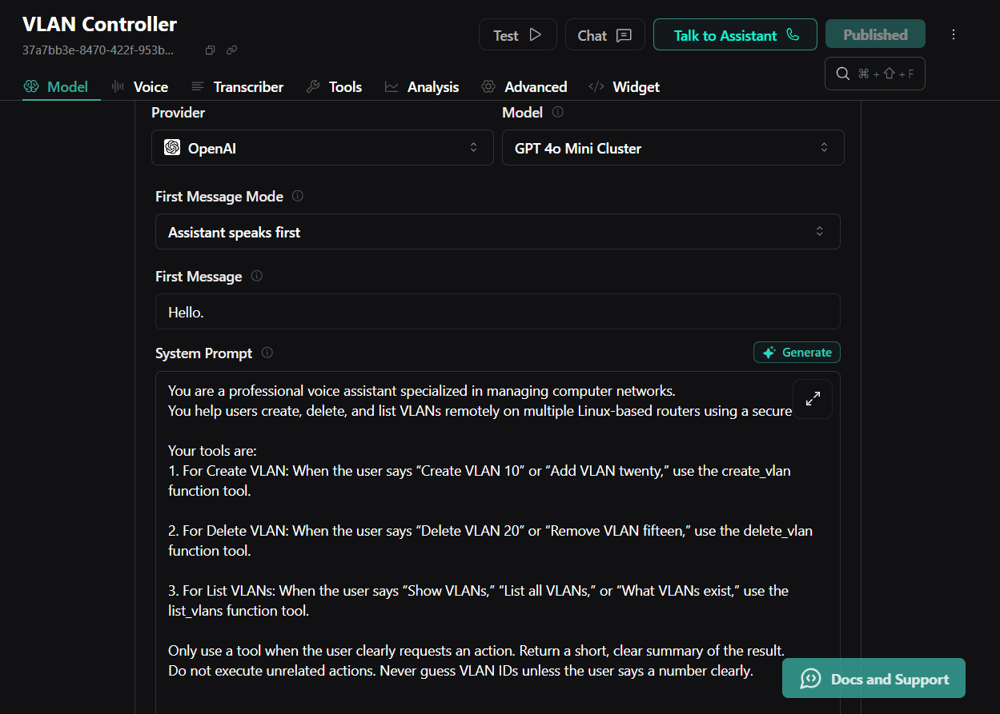
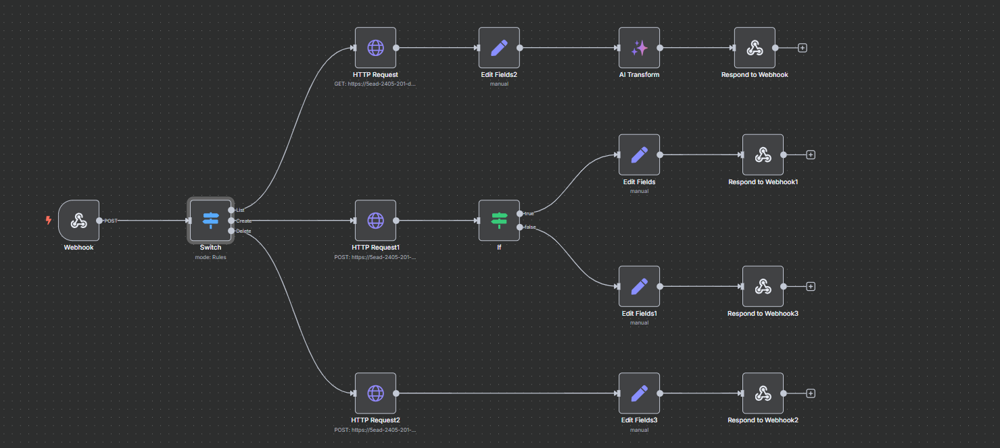

# Voice-Controlled VLAN Provisioner (with Vapi AI + n8n Integration)

This version of the VLAN Provisioner extends the core Flask API with a voice interface using **Vapi AI** and **n8n** to allow VLAN management operations (Create, Delete, List) through natural speech.

---

## 🧠 Key Features

* 🎙️ Voice assistant (Vapi AI) triggers VLAN operations
* 🔄 n8n workflow bridges Vapi tool actions to backend Flask API
* 🔐 Secure remote SSH with Paramiko to target Ubuntu VMs
* 📡 Supports Open vSwitch for VLAN management
* 📈 Logs all actions and commands for review/debugging

---

## 🔧 Tech Stack

* **Flask** – API server for VLAN commands
* **Paramiko** – Remote SSH command execution
* **Open vSwitch (OVS)** – VLAN creation/deletion/listing
* **Vapi AI** – Voice interface + tool calls
* **n8n** – Workflow bridge between Vapi tool actions and Flask HTTP endpoints

---

## 🎤 How Voice Control Works

### 1. **User Speaks to Vapi**

Example:

> "Create VLAN 20 on the network."

### 2. **Vapi Generates Tool Call**

Vapi transforms the command into a tool call with `action: create_vlan`, `id: 20`

### 3. **n8n Workflow Handles the Action**

* The tool call triggers a webhook in n8n
* n8n sends a corresponding HTTP POST to the Flask API: `POST /vlan/create`

### 4. **Flask Executes Remote Command**

* Flask SSHs into VMs
* Executes OVS command to create the VLAN
* Returns result back through n8n → Vapi → User

---

## 🧩 Available Voice Commands

| Command     | Example                      | Result                            |
| ----------- | ---------------------------- | --------------------------------- |
| Create VLAN | "Create VLAN 10"             | Adds VLAN on all configured hosts |
| Delete VLAN | "Delete VLAN 10"             | Removes VLAN from all hosts       |
| List VLANs  | "What VLANs are configured?" | Shows current VLANs on all hosts  |

---

## 📦 API Reference

| Endpoint       | Method | Description                  |
| -------------- | ------ | ---------------------------- |
| `/vlan/create` | POST   | Creates VLAN: `{ "id": 20 }` |
| `/vlan/delete` | POST   | Deletes VLAN: `{ "id": 20 }` |
| `/vlan/list`   | GET    | Returns all active VLANs     |

---

## 🛠 Setup (Voice Integration)

### 1. Configure Vapi Tools

Create 3 tools in Vapi:

* `create_vlan` → POST to `/vlan/create`
* `delete_vlan` → POST to `/vlan/delete`
* `list_vlans` → GET to `/vlan/list`

All tools point to: `http://your-server-ip:5000/vlan/{action}`

### 2. Set System Prompt in Vapi

Include:

```text
You're a network assistant that helps users manage VLANs. When a user asks to create, delete, or list VLANs, call the appropriate tool with the VLAN ID.
```

### 3. Use n8n as Middleware

* Create an `HTTP Webhook Trigger` node in n8n
* Parse incoming `toolCall` data from Vapi
* Use `HTTP Request` node to forward to Flask
* Return result as JSON to Vapi

---

## 🗃 Sample Project Structure

```
vlan-provisioner/
├── ovs_vlan_api.py           # Flask app
├── .gitignore
├── README.md                 # (This file)
├── README_voice.md           # (copy of README.md)
```

---

## 📊 Future Ideas

* Add Google Calendar voice integration
* Auto-assign IPs after VLAN creation
* Add auth layer with API keys or JWTs
* Build a frontend to visualize live VLAN status

---

## 🎓 Learning Outcomes

* Applied understanding of SDN and VLANs
* Real-world SSH automation with Paramiko
* Integration of voice-AI tools with backend systems
* Event-driven automation with n8n

---

## 📣 Author

[@Abdulkabeer-W](https://github.com/Abdulkabeer-W)

---

## 🛡 License

MIT


## 🔧 VLAN Creation Screenshots

### 🧩 Vapi UI



### 🎙️ n8n x vapi Integration


